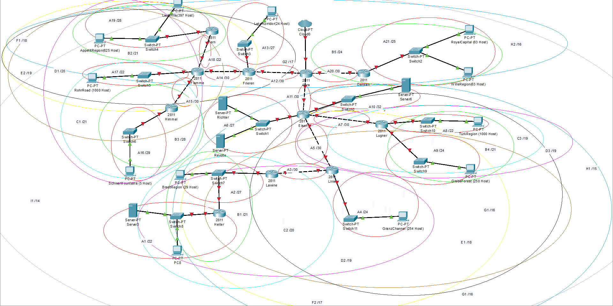
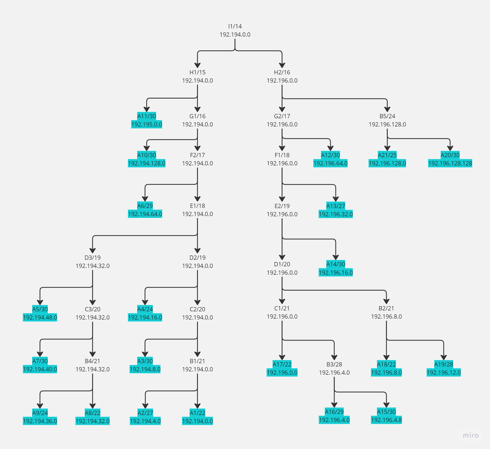
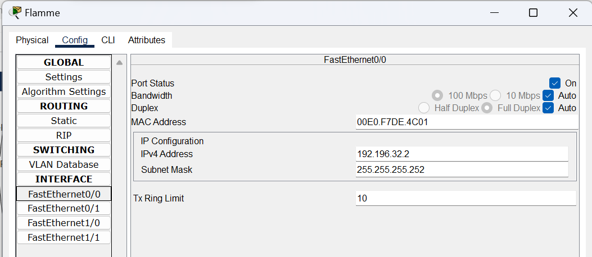
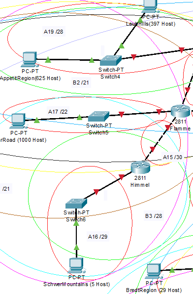

# <div align="center"><p>Jarkom-Modul-4-D06-2023</p></div>

## Anggota Kelompok

| Nama                               | NRP        |
| ---------------------------------- | ---------- |
| Achmad Khosyi’ Assajjad Ramandanta | 5025211007 |
| Daud Dhiya' Rozaan                 | 5025211021 |

Pembagian Rute dengan jumlah IP dan Netmask tiap Subnet:


Jumlah IP tiap Subnet dapat didapat dari banyaknya host ditambah jumlah gateaway di subnet tersebut.
Total jumlah IP adalah 4255 dan berada di Netmask /19.

## VLSM menggunakan GNS3

### Membuat Tree :


- Puncak dari tree diawali dengan [prefix IP].0.0/(total jumlah netmask). Kelompok kami (D06) memiliki prefix IP `192.194` sehingga IP di puncak tree adalah `192.194.0.0/19`
- Setiap kali turun, IP di sisi kiri selalu sama namun jumlah Netmasknya bertambah 1. Di sisi kanan, IP akan menjadi [prefix IP].x.x (x sebelumnya + bit di posisi subnet). Contoh di /19, maka memiliki 16 bit dan berada di pembagian bit ip ketiga. Maka menjadi `192.194.16.0/20`.
- Kami menghitung dan mengambil di bagian kanan terlebih dahulu apabila terdapat Subnet yang jumlah Netmasknya sudah sesuai. Seperti pada tree kami, posisi /29 berada di paling kanan.
- Apabila di sebelah kanan subnet yang tersedia sudah diambil, maka di sebelah kiri tinggal turun saja tanpa dibagi.

### Pembagian IP :


- Dari tree sebelumnya, didapatkan NID dan IP Netmask dari tiap subnetnya.
- Untuk menghitung Broadcast, terlebih dahulu mengubah IP NID dan Netmask menjadi bit. Lalu bit dari IP Netmask di invert. Selanjutnya lakukan operasi OR dari bit IP NID dan bit IP Netmask yang sudah di invert. Terakhir ubah bit menjadi IP dan didapatkaan Broadcast nya.


- Lakukan pembagian IP tiap router dan node. IP datam diambil dengan rentan IP NID dan Broadcast.

### Pembuatan Topologi dan Konfigurasi :


- Aura :

```
auto eth0
iface eth0 inet dhcp

auto eth1
iface eth1 inet static
	address 192.194.0.133
	netmask 255.255.255.252

auto eth2
iface eth2 inet static
	address 192.194.0.137
	netmask 255.255.255.252

auto eth3
iface eth3 inet static
	address 192.194.0.141
	netmask 255.255.255.252
```

- Friren :

```
auto eth0
iface eth0 inet static
	address 192.194.0.134
	netmask 255.255.255.252

auto eth1
iface eth1 inet static
	address 192.194.0.129
	netmask 255.255.255.252

auto eth2
iface eth2 inet static
	address 192.194.0.161
	netmask 255.255.255.224
```

- LakeKorridor :

```
auto eth0
iface eth0 inet static
	address 192.194.0.162
	netmask 255.255.255.224
	gateway 192.194.0.161
```

- Flamme :

```
auto eth0
iface eth0 inet static
	address 192.194.0.130
	netmask 255.255.255.252

auto eth1
iface eth1 inet static
	address 192.194.0.29
	netmask 255.255.255.252

auto eth2
iface eth2 inet static
	address 192.194.20.1
	netmask 255.255.252.0

auto eth3
iface eth3 inet static
	address 192.194.0.25
	netmask 255.255.255.252
```

- Fern :

```
auto eth0
iface eth0 inet static
	address 192.194.0.30
	netmask 255.255.255.252

auto eth1
iface eth1 inet static
	address 192.194.24.1
	netmask 255.255.248.0
```

- LaubHills :

```
auto eth0
iface eth0 inet static
	address 192.194.24.3
	netmask 255.255.248.0
	gateway 192.194.24.1
```

- AppetitRegion :

```
auto eth0
iface eth0 inet static
	address 192.194.24.2
	netmask 255.255.248.0
	gateway 192.194.24.1
```

- RohrRoad :

```
auto eth0
iface eth0 inet static
	address 192.194.20.2
	netmask 255.255.252.0
	gateway 192.194.20.1
```

- Himmel :

```
auto eth0
iface eth0 inet static
	address 192.194.0.26
	netmask 255.255.255.248

auto eth1
iface eth1 inet static
	address 192.194.0.153
	netmask 255.255.255.252
```

- SchwerMountains :

```
auto eth0
iface eth0 inet static
	address 192.194.0.154
	netmask 255.255.255.248
	gateway 192.194.0.153
```

- Denken :

```
auto eth0
iface eth0 inet static
    address 192.194.0.142
    netmask 255.255.255.252

auto eth1
iface eth1 inet static
    address 192.194.8.1
    netmask 255.255.255.0
```

- RoyalCapital :

```
auto eth0
iface eth0 inet static
	address 192.194.8.2
	netmask 255.255.255.0
	gateway 192.194.8.1
```

- WillieRegion :

```
auto eth0
iface eth0 inet static
	address 192.194.8.3
	netmask 255.255.255.0
	gateway 192.194.8.1
```

- Eisen :

```
auto eth0
iface eth0 inet static
	address 192.194.0.138
	netmask 255.255.255.252

auto eth1
iface eth1 inet static
	address 192.194.0.145
	netmask 255.255.255.248

auto eth2
iface eth2 inet static
	address 192.194.0.21
	netmask 255.255.255.252

auto eth3
iface eth3 inet static
	address 192.194.0.17
	netmask 255.255.255.252

auto eth4
iface eth4 inet static
	address 192.194.0.5
	netmask 255.255.255.252
```

- Stark :

```
auto eth0
iface eth0 inet static
	address 192.194.0.6
	netmask 255.255.255.252
	gateway 192.194.0.5
```

- Richter :

```
auto eth0
iface eth0 inet static
	address 192.194.0.146
	netmask 255.255.255.248
	gateway 192.194.0.145
```

- Revolter :

```
auto eth0
iface eth0 inet static
	address 192.194.0.147
	netmask 255.255.255.248
	gateway 192.194.0.145
```

- Lugner :

```
auto eth0
iface eth0 inet static
	address 192.194.0.18
	netmask 255.255.255.252

auto eth1
iface eth1 inet static
	address 192.194.9.1
	netmask 255.255.255.0

auto eth2
iface eth2 inet static
	address 192.194.16.1
	netmask 255.255.255.0
```

- TurkRegion :

```
auto eth0
iface eth0 inet static
	address 192.194.16.2
	netmask 255.255.255.0
	gateway 192.194.16.1
```

- GrobeForest :

```
auto eth0
iface eth0 inet static
	address 192.194.9.2
	netmask 255.255.255.0
	gateway 192.194.9.1
```

- Linie :

```
auto eth0
iface eth0 inet static
	address 192.194.0.22
	netmask 255.255.255.252

auto eth1
iface eth1 inet static
	address 192.194.0.1
	netmask 255.255.255.252

auto eth2
iface eth2 inet static
	address 192.194.10.1
	netmask 255.255.254.0
```

- GrainzChannel :

```
auto eth0
iface eth0 inet static
	address 192.194.10.2
	netmask 255.255.254.0
	gateway 192.194.10.1
```

- Lawine :

```
auto eth0
iface eth0 inet static
	address 192.194.0.2
	netmask 255.255.255.252

auto eth1
iface eth1 inet static
	address 192.194.0.193
	netmask 255.255.255.192
```

- BredtRegion :

```
auto eth0
iface eth0 inet static
	address 192.194.0.194
	netmask 255.255.255.192
	gateway 192.194.0.193

```

- Heiter :

```
auto eth0
iface eth0 inet static
	address 192.194.0.195
	netmask 255.255.255.192

auto eth1
iface eth1 inet static
	address 192.194.12.1
	netmask 255.255.252.0
```

- Sein :

```
auto eth0
iface eth0 inet static
	address 192.194.12.3
	netmask 255.255.252.0
	gateway 192.194.12.1
```

- ReigelCanyon :

```
auto eth0
iface eth0 inet static
	address 192.194.12.2
	netmask 255.255.252.0
	gateway 192.194.12.1
```

- Untuk pengecekan apakah konfigurasi sudah benar, dapat melakukan ping antar router dan node dalam satu subnet.

### Routing

- Aura :

```
route add -net 192.194.0.160 netmask 255.255.255.224 gw 192.194.0.134
route add -net 192.194.0.128 netmask 255.255.255.252 gw 192.194.0.134
route add -net 192.194.24.0 netmask 255.255.248.0 gw 192.194.0.134
route add -net 192.194.0.28 netmask 255.255.255.252 gw 192.194.0.134
route add -net 192.194.20.0 netmask 255.255.252.0 gw 192.194.0.134
route add -net 192.194.0.24 netmask 255.255.255.252 gw 192.194.0.134
route add -net 192.194.0.152 netmask 255.255.255.248 gw 192.194.0.134
route add -net 192.194.8.0 netmask 255.255.255.0 gw 192.194.0.142
route add -net 192.194.0.4 netmask 255.255.255.252 gw 192.194.0.138
route add -net 192.194.0.144 netmask 255.255.255.248 gw 192.194.0.138
route add -net 192.194.9.0 netmask 255.255.255.0 gw 192.194.0.138
route add -net 192.194.16.0 netmask 255.255.252.0 gw 192.194.0.138
route add -net 192.194.0.16 netmask 255.255.255.252 gw 192.194.0.138
route add -net 192.194.0.20 netmask 255.255.255.252 gw 192.194.0.138
route add -net 192.194.12.0 netmask 255.255.252.0 gw 192.194.0.138
route add -net 192.194.0.192 netmask 255.255.255.192 gw 192.194.0.138
route add -net 192.194.10.0 netmask 255.255.254.0 gw 192.194.0.138
route add -net 192.194.0.0 netmask 255.255.255.252 gw 192.194.0.138
```

- Frieren :

```
route add -net 0.0.0.0 netmask 0.0.0.0 gw 192.194.0.133
route add -net 192.194.24.0 netmask 255.255.248.0 gw 192.194.0.130
route add -net 192.194.0.28 netmask 255.255.255.252 gw 192.194.0.130
route add -net 192.194.20.0 netmask 255.255.252.0 gw 192.194.0.130
route add -net 192.194.0.24 netmask 255.255.255.252 gw 192.194.0.130
route add -net 192.194.0.152 netmask 255.255.255.248 gw 192.194.0.130
```

- Flamme :

```
route add -net 0.0.0.0 netmask 0.0.0.0 gw 192.194.0.129
route add -net 192.194.24.0 netmask 255.255.248.0 gw 192.194.0.30
route add -net 192.194.0.152 netmask 255.255.255.248 gw 192.194.0.26
```

- Eisen :

```
route add -net 0.0.0.0 netmask 0.0.0.0 gw 192.194.0.137
route add -net 192.194.12.0 netmask 255.255.252.0 gw 192.194.0.22
route add -net 192.194.0.192 netmask 255.255.255.192 gw 192.194.0.22
route add -net 192.194.10.0 netmask 255.255.254.0 gw 192.194.0.22
route add -net 192.194.0.0 netmask 255.255.255.252 gw 192.194.0.22
route add -net 192.194.9.0 netmask 255.255.255.0 gw 192.194.0.18
route add -net 192.194.16.0 netmask 255.255.252.0 gw 192.194.0.18
```

- Lugner :

```
route add -net 0.0.0.0 netmask 0.0.0.0 gw 192.194.0.17
```

- Linie :

```
route add -net 0.0.0.0 netmask 0.0.0.0 gw 192.194.0.21
route add -net 192.194.0.192 netmask 255.255.255.192 gw 192.194.0.2
route add -net 192.194.12.0 netmask 255.255.252.0 gw 192.194.0.2
```

- Lawine :

```
route add -net 0.0.0.0 netmask 0.0.0.0 gw 192.194.0.1
route add -net 192.194.12.0 netmask 255.255.252.0 gw 192.194.0.195
```

- Heiter :

```
route add -net 0.0.0.0 netmask 0.0.0.0 gw 192.194.0.193
```

- Fern :

```
route add -net 0.0.0.0 netmask 0.0.0.0 gw 192.194.0.29
```

- Himmel :

```
route add -net 0.0.0.0 netmask 0.0.0.0 gw 192.194.0.25
```

- Denken :

```
route add -net 0.0.0.0 netmask 0.0.0.0 gw 192.194.0.141
```

- Untuk pengecekan apakah routing sudah benar, dapat melakukan ping antar router dan node dengan acak.

## CIDR menggunakan CPT

### Membuat Topologi & Subnetting




### Perhitungan IP & Penggabungan Subnet

[Link Spreadsheet](https://docs.google.com/spreadsheets/d/115_dvdFe_R30PJp_okh2Cx94XIaN5sJoWD3NaztBQeM/edit#gid=699820178)

### Membuat Tree :



### Mengatur IP pada Interface :

- Pada Router (Contoh)

  

- Pada Client (Contoh)

  

### Routing :



Contoh :

Jika ingin melakukan routing pada `Flamme`, maka kita perlu mengkonfigurasi routing untuk A7, A10, dan router-router yang bersebelahan dengan `Flamme`.


### Contoh Successful saat mengirimkan pesan :


